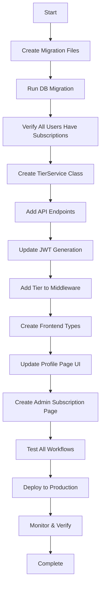

# User Tier System - Implementation Guide

**Version:** 1.0.0  
**Date:** 2025-10-28  
**Status:** ✅ Ready for Code Mode Implementation  
**Related:** [USER-TIER-SYSTEM-PLAN.md](./USER-TIER-SYSTEM-PLAN.md)

---

## Table of Contents

1. [Implementation Workflow](#implementation-workflow)
2. [Integration Points](#integration-points)
3. [API Endpoint Specifications](#api-endpoint-specifications)
4. [Frontend Components](#frontend-components)
5. [Testing Strategy](#testing-strategy)
6. [Deployment Checklist](#deployment-checklist)
7. [Rollback Plan](#rollback-plan)

---

## Implementation Workflow

### Phase 1: Foundation (Current Sprint)

**Goal:** Add tier infrastructure without breaking existing functionality



### Execution Order

**Day 1: Database & Backend Core**
1. Create `migrations/002_create_tier_system.sql`
2. Run migration on local database
3. Verify with SQL queries
4. Create `services/tier_service.py`
5. Add tier endpoints to [`my_os.py`](../my_os.py)
6. Update JWT generation in signup/login/profile

**Day 2: Frontend & Admin Interface**
7. Create TypeScript types
8. Update [`AuthContext.tsx`](../cirkelline-ui/src/contexts/AuthContext.tsx)
9. Add tier display to profile page
10. Create admin subscription management page
11. Add tier info to user management page

**Day 3: Testing & Deployment**
12. Test all upgrade/downgrade flows
13. Test admin tier assignment
14. Verify JWT includes tier info
15. Check backward compatibility
16. Deploy to staging
17. Final verification & production deploy

---

## Integration Points

### 1. Existing Code Modifications Required

#### A. [`my_os.py`](../my_os.py) - JWT Generation

**Location 1: Signup** (lines 2920-2976)

```python
# CURRENT CODE (line 2920-2976)
jwt_payload = {
    "user_id": str(new_user[0]),
    "email": new_user[1],
    "display_name": new_user[2],
    "iat": int(time.time()),
    "exp": int(time.time()) + (7 * 24 * 60 * 60)
}

# ADD AFTER LINE 2942 (after admin profile check):
# Get user's subscription tier
tier_info = session.execute(
    text("""
        SELECT s.tier_slug, t.tier_level, s.status
        FROM user_subscriptions s
        JOIN user_tiers t ON s.tier_slug = t.slug
        WHERE s.user_id = :user_id AND s.status = 'active'
        LIMIT 1
    """),
    {"user_id": str(new_user[0])}
).fetchone()

# ADD TO JWT PAYLOAD (before line 2974):
jwt_payload.update({
    "tier_slug": tier_info[0] if tier_info else "member",
    "tier_level": tier_info[1] if tier_info else 1,
    "subscription_status": tier_info[2] if tier_info else "active"
})
```

**Location 2: Login** (lines 3105-3160)

```python
# SAME PATTERN - Add after admin profile check (line 3140)
# Query tier info and add to JWT payload before signing
```

**Location 3: Profile Update** (lines 2088-2112)

```python
# ADD tier info query before new_token generation (line 2112)
```

#### B. [`my_os.py`](../my_os.py) - Create Subscription on Signup

**Location:** After user creation (line 2910)

```python
# AFTER THIS LINE:
session.commit()

# ADD:
# Create default Member subscription for new user
from services.tier_service import TierService
subscription_id, _ = await TierService.create_subscription(
    engine=engine,
    user_id=str(new_user[0]),
    tier_slug='member',
    billing_cycle='monthly'
)

# Update user with subscription ID
session.execute(
    text("UPDATE users SET subscription_id = :sub_id WHERE id = :user_id"),
    {"sub_id": subscription_id, "user_id": str(new_user[0])}
)
session.commit()
```

#### C. [`AuthContext.tsx`](../cirkelline-ui/src/contexts/AuthContext.tsx)

**Update User Interface** (line 6-12)

```typescript
interface User {
  user_id: string;
  email?: string;
  display_name?: string;
  isAnonymous: boolean;
  is_admin?: boolean;
  // NEW: Add tier information
  tier_slug?: string;
  tier_level?: number;
  subscription_status?: string;
}
```

**Update JWT Decode** (line 54-60)

```typescript
setUser({
  user_id: payload.user_id,
  email: payload.email,
  display_name: payload.display_name,
  isAnonymous: false,
  is_admin: payload.is_admin,
  // NEW: Extract tier from JWT
  tier_slug: payload.tier_slug || 'member',
  tier_level: payload.tier_level || 1,
  subscription_status: payload.subscription_status || 'active',
});
```

### 2. New Files to Create

#### Backend Files

```
/services/tier_service.py           # Tier business logic
/services/__init__.py               # Service exports
/migrations/002_create_tier_system.sql  # Database migration
```

#### Frontend Files

```
/cirkelline-ui/src/types/subscription.ts           # Type definitions
/cirkelline-ui/src/app/admin/subscriptions/page.tsx  # Admin subscriptions page
/cirkelline-ui/src/components/TierBadge.tsx        # Tier display component
/cirkelline-ui/src/components/TierUpgradeModal.tsx  # Upgrade modal
/cirkelline-ui/src/components/SubscriptionCard.tsx  # Subscription info card
/cirkelline-ui/src/hooks/useSubscription.ts        # Subscription data hook
```

---

## API Endpoint Specifications

### Complete API Reference

#### Public Endpoints

```
GET /api/tiers
└─ Returns: List of all available tiers with pricing
└─ Auth: None required
└─ Response: 200 OK
   {
     "success": true,
     "tiers": [
       {
         "slug": "member",
         "name": "Member",
         "description": "Free tier...",
         "tier_level": 1,
         "monthly_price_cents": 0,
         "annual_price_cents": 0,
         "is_active": true,
         "features": {}
       },
       // ... other tiers
     ]
   }
```

#### User Subscription Endpoints

```
GET /api/user/subscription
└─ Returns: Current user's subscription details
└─ Auth: JWT required
└─ Response: 200 OK
   {
     "success": true,
     "subscription": {
       "id": "uuid",
       "tier": {
         "slug": "pro",
         "name": "Pro",
         "level": 2,
         "description": "...",
         "monthly_price_cents": 999,
         "annual_price_cents": 9990
       },
       "billing_cycle": "monthly",
       "status": "active",
       "started_at": "2025-10-01T00:00:00Z",
       "current_period_start": "2025-10-01T00:00:00Z",
       "current_period_end": "2025-11-01T00:00:00Z",
       "cancelled_at": null,
       "ends_at": null
     },
     "available_tiers": [...],
     "available_upgrades": [...],
     "can_upgrade": true
   }

POST /api/user/subscription/upgrade
└─ Creates upgrade request (Phase 1: admin approval, Phase 2: payment)
└─ Auth: JWT required
└─ Body: {
     "tier_slug": "pro",
     "billing_cycle": "monthly"
   }
└─ Response: 200 OK
   {
     "success": true,
     "message": "Upgrade request created...",
     "upgrade": {
       "subscription_id": "uuid",
       "old_tier": "member",
       "new_tier": "pro",
       "effective_immediately": true,
       "next_billing": "2025-11-28T00:00:00Z"
     }
   }

POST /api/user/subscription/downgrade
└─ Schedule downgrade at end of billing cycle
└─ Auth: JWT required
└─ Body: {
     "tier_slug": "member",
     "reason": "Optional reason"
   }
└─ Response: 200 OK
   {
     "success": true,
     "message": "Downgrade scheduled for...",
     "downgrade": {
       "subscription_id": "uuid",
       "old_tier": "pro",
       "new_tier": "member",
       "effective_date": "2025-11-01T00:00:00Z",
       "remains_active_until": "2025-11-01T00:00:00Z"
     }
   }

DELETE /api/user/subscription/cancel
└─ Cancel paid subscription (reverts to free)
└─ Auth: JWT required
└─ Body: {
     "reason": "Optional cancellation reason"
   }
└─ Response: 200 OK
   {
     "success": true,
     "message": "Subscription cancelled",
     "cancellation": {
       "cancelled": true,
       "remains_active_until": "2025-11-01T00:00:00Z",
       "reverts_to_tier": "member"
     }
   }
```

#### Admin Endpoints

```
GET /api/admin/subscriptions?page=1&limit=20&tier_filter=all&status_filter=active
└─ List all subscriptions
└─ Auth: Admin JWT required
└─ Response: 200 OK
   {
     "success": true,
     "data": [
       {
         "id": "uuid",
         "user_id": "uuid",
         "user_email": "user@example.com",
         "user_display_name": "User Name",
         "tier_slug": "pro",
         "tier_name": "Pro",
         "tier_level": 2,
         "billing_cycle": "monthly",
         "status": "active",
         "started_at": "2025-10-01T00:00:00Z",
         "current_period_end": "2025-11-01T00:00:00Z",
         "cancelled_at": null,
         "payment_provider": null
       }
     ],
     "total": 145,
     "page": 1,
     "limit": 20
   }

POST /api/admin/subscriptions/:user_id/assign-tier
└─ Admin assigns tier (bypasses payment)
└─ Auth: Admin JWT required
└─ Body: {
     "tier_slug": "pro",
     "billing_cycle": "monthly",
     "reason": "Promotion for beta tester"
   }
└─ Response: 200 OK
   {
     "success": true,
     "message": "Tier pro assigned to user",
     "subscription": {
       "id": "uuid",
       "user_id": "uuid",
       "tier_slug": "pro",
       "status": "active"
     }
   }

GET /api/admin/subscription-stats
└─ Get subscription statistics
└─ Auth: Admin JWT required
└─ Response: 200 OK
   {
     "success": true,
     "stats": {
       "total_subscriptions": 145,
       "active_subscriptions": 142,
       "by_tier": {
         "member": 120,
         "pro": 15,
         "business": 5,
         "elite": 2,
         "family": 0
       },
       "by_billing_cycle": {
         "monthly": 18,
         "annual": 4
       }
     }
   }

GET /api/admin/subscriptions/:user_id/history
└─ Get subscription change history for user
└─ Auth: Admin JWT required
└─ Response: 200 OK
   {
     "success": true,
     "history": [
       {
         "id": "uuid",
         "action": "upgraded",
         "from_tier_slug": "member",
         "to_tier_slug": "pro",
         "changed_by_user_id": "admin-uuid",
         "is_admin_action": true,
         "reason": "Beta tester reward",
         "created_at": "2025-10-28T12:00:00Z"
       }
     ]
   }
```

---

## Integration Points with Existing Code

### 1. Signup Flow Integration

**Current Flow:**
```
User submits signup form
  ↓
POST /api/auth/signup
  ↓
Create user in users table
  ↓
Generate JWT
  ↓
Return token to frontend
```

**New Flow:**
```
User submits signup form
  ↓
POST /api/auth/signup
  ↓
Create user in users table
  ↓
Create Member subscription  ← NEW
  ↓
Update user.subscription_id  ← NEW
  ↓
Query tier info              ← NEW
  ↓
Generate JWT with tier       ← MODIFIED
  ↓
Return token to frontend
```

**Code Changes:**
- File: [`my_os.py`](../my_os.py)
- Lines: 2868-2998 (signup endpoint)
- Add: Subscription creation after line 2910
- Modify: JWT generation at line 2974

### 2. Login Flow Integration

**Current Flow:**
```
User submits login
  ↓
POST /api/auth/login
  ↓
Verify password
  ↓
Update last_login
  ↓
Generate JWT
  ↓
Return token
```

**New Flow:**
```
User submits login
  ↓
POST /api/auth/login
  ↓
Verify password
  ↓
Update last_login
  ↓
Query current tier           ← NEW
  ↓
Generate JWT with tier       ← MODIFIED
  ↓
Return token
```

**Code Changes:**
- File: [`my_os.py`](../my_os.py)
- Lines: 3032-3192 (login endpoint)
- Add: Tier query before line 3158
- Modify: JWT generation at line 3158

### 3. Profile Update Flow Integration

**Current Flow:**
```
User updates profile
  ↓
PATCH /api/user/profile
  ↓
Update users table
  ↓
Generate new JWT
  ↓
Return updated token
```

**New Flow:**
```
User updates profile
  ↓
PATCH /api/user/profile
  ↓
Update users table
  ↓
Query current tier           ← NEW
  ↓
Generate new JWT with tier   ← MODIFIED
  ↓
Return updated token
```

**Code Changes:**
- File: [`my_os.py`](../my_os.py)
- Lines: 2007-2167 (profile update endpoint)
- Add: Tier query before line 2112
- Modify: JWT generation at line 2112

### 4. Admin User Management Integration

**Update Existing Admin Users Page:**
- File: `cirkelline-ui/src/app/admin/users/page.tsx`
- Add: Tier badge display in user cards
- Add: Quick tier assignment action
- Add: Filter by tier

**User Details View Enhancement:**
- Show current tier and subscription status
- Show subscription history
- Add "Change Tier" admin action

### 5. User Profile Page Integration

**Current Profile Page:**
- Display name, email
- Bio, location, job title
- Custom instructions
- Theme & accent color settings

**Enhanced Profile Page:**
- Add "Your Plan" section showing:
  - Current tier badge
  - Subscription status
  - Next billing date (if paid)
  - "Upgrade Plan" button
  - "Manage Subscription" button

**Code Changes:**
- File: `cirkelline-ui/src/app/profile/page.tsx`
- Add: Subscription section after profile fields
- Add: useSubscription hook for data fetching

---

## Frontend Components

### 1. TierBadge Component

**Purpose:** Display tier with appropriate styling

```typescript
// /cirkelline-ui/src/components/TierBadge.tsx

interface TierBadgeProps {
  tier: 'member' | 'pro' | 'business' | 'elite' | 'family'
  size?: 'sm' | 'md' | 'lg'
  showIcon?: boolean
}

export function TierBadge({ tier, size = 'md', showIcon = true }: TierBadgeProps) {
  const config = {
    member: {
      label: 'Member',
      color: 'gray',
      icon: <Users className="w-4 h-4" />
    },
    pro: {
      label: 'Pro',
      color: 'blue',
      icon: <Zap className="w-4 h-4" />
    },
    business: {
      label: 'Business',
      color: 'purple',
      icon: <Briefcase className="w-4 h-4" />
    },
    elite: {
      label: 'Elite',
      color: 'yellow',
      icon: <Crown className="w-4 h-4" />
    },
    family: {
      label: 'Family',
      color: 'pink',
      icon: <Heart className="w-4 h-4" />
    }
  }
  
  const { label, color, icon } = config[tier]
  
  return (
    <span className={`tier-badge tier-${color} size-${size}`}>
      {showIcon && icon}
      {label}
    </span>
  )
}
```

### 2. SubscriptionCard Component

**Purpose:** Display user's subscription details

```typescript
// /cirkelline-ui/src/components/SubscriptionCard.tsx

interface SubscriptionCardProps {
  subscription: UserSubscription
  onUpgrade?: () => void
  onManage?: () => void
}

export function SubscriptionCard({ subscription, onUpgrade, onManage }: SubscriptionCardProps) {
  const isFree = subscription.tier.slug === 'member'
  const isCancelled = subscription.status === 'cancelled'
  const daysRemaining = subscription.current_period_end 
    ? Math.ceil((new Date(subscription.current_period_end).getTime() - Date.now()) / (1000 * 60 * 60 * 24))
    : null
  
  return (
    <div className="subscription-card">
      <div className="tier-header">
        <TierBadge tier={subscription.tier.slug} />
        <h3>{subscription.tier.name}</h3>
      </div>
      
      <p className="tier-description">{subscription.tier.description}</p>
      
      {!isFree && (
        <div className="billing-info">
          <p>Billing: {subscription.billing_cycle}</p>
          {subscription.current_period_end && (
            <p>Next billing: {new Date(subscription.current_period_end).toLocaleDateString()}</p>
          )}
          {daysRemaining && daysRemaining <= 7 && (
            <p className="warning">{daysRemaining} days remaining</p>
          )}
        </div>
      )}
      
      {isCancelled && (
        <div className="status-warning">
          <AlertTriangle className="w-4 h-4" />
          <p>Subscription cancelled - ends {subscription.ends_at}</p>
        </div>
      )}
      
      <div className="actions">
        {onUpgrade && <button onClick={onUpgrade}>Upgrade Plan</button>}
        {onManage && !isFree && <button onClick={onManage}>Manage Subscription</button>}
      </div>
    </div>
  )
}
```

### 3. TierUpgradeModal Component

**Purpose:** Allow users to select and upgrade tier

```typescript
// /cirkelline-ui/src/components/TierUpgradeModal.tsx

export function TierUpgradeModal({ isOpen, onClose, currentTier }: TierUpgradeModalProps) {
  const [selectedTier, setSelectedTier] = useState<string | null>(null)
  const [billingCycle, setBillingCycle] = useState<'monthly' | 'annual'>('monthly')
  const [availableTiers, setAvailableTiers] = useState<UserTier[]>([])
  
  useEffect(() => {
    // Fetch available upgrade tiers
    fetchAvailableTiers()
  }, [])
  
  const handleUpgrade = async () => {
    if (!selectedTier) return
    
    try {
      const response = await fetch(`${API_URL}/api/user/subscription/upgrade`, {
        method: 'POST',
        headers: {
          'Authorization': `Bearer ${localStorage.getItem('token')}`,
          'Content-Type': 'application/json'
        },
        body: JSON.stringify({
          tier_slug: selectedTier,
          billing_cycle: billingCycle
        })
      })
      
      const data = await response.json()
      
      if (data.success) {
        // Phase 1: Show success message about admin approval
        toast.success(data.message)
        onClose()
      }
    } catch (error) {
      toast.error('Failed to request upgrade')
    }
  }
  
  return (
    <Modal isOpen={isOpen} onClose={onClose}>
      <h2>Upgrade Your Plan</h2>
      
      <TierComparison 
        tiers={availableTiers}
        currentTier={currentTier}
        onSelect={setSelectedTier}
      />
      
      <BillingCycleToggle 
        value={billingCycle}
        onChange={setBillingCycle}
      />
      
      {selectedTier && (
        <div className="upgrade-summary">
          <p>Upgrading to: <TierBadge tier={selectedTier} /></p>
          <p>Billing: {billingCycle}</p>
          <p className="note">Contact admin for payment setup</p>
        </div>
      )}
      
      <button onClick={handleUpgrade} disabled={!selectedTier}>
        Request Upgrade
      </button>
    </Modal>
  )
}
```

### 4. Admin Subscriptions Page

**Purpose:** Admin interface for managing all subscriptions

```typescript
// /cirkelline-ui/src/app/admin/subscriptions/page.tsx

export default function AdminSubscriptionsPage() {
  const [subscriptions, setSubscriptions] = useState<any[]>([])
  const [stats, setStats] = useState<SubscriptionStats | null>(null)
  const [filters, setFilters] = useState({
    tier: 'all',
    status: 'all',
    page: 1,
    limit: 20
  })
  
  const fetchSubscriptions = async () => {
    const response = await fetch(
      `${API_URL}/api/admin/subscriptions?` + new URLSearchParams({
        page: filters.page.toString(),
        limit: filters.limit.toString(),
        tier_filter: filters.tier,
        status_filter: filters.status
      }),
      {
        headers: { 'Authorization': `Bearer ${localStorage.getItem('token')}` }
      }
    )
    
    const data = await response.json()
    setSubscriptions(data.data)
  }
  
  const fetchStats = async () => {
    const response = await fetch(`${API_URL}/api/admin/subscription-stats`, {
      headers: { 'Authorization': `Bearer ${localStorage.getItem('token')}` }
    })
    
    const data = await response.json()
    setStats(data.stats)
  }
  
  const handleAssignTier = async (userId: string, tierSlug: string) => {
    const response = await fetch(
      `${API_URL}/api/admin/subscriptions/${userId}/assign-tier`,
      {
        method: 'POST',
        headers: {
          'Authorization': `Bearer ${localStorage.getItem('token')}`,
          'Content-Type': 'application/json'
        },
        body: JSON.stringify({
          tier_slug: tierSlug,
          billing_cycle: 'monthly',
          reason: 'Admin manual assignment'
        })
      }
    )
    
    if (response.ok) {
      toast.success('Tier assigned successfully')
      fetchSubscriptions()
    }
  }
  
  return (
    <AdminLayout>
      <h1>Subscription Management</h1>
      
      {/* Stats Cards */}
      <div className="stats-grid">
        <StatCard title="Total Subscriptions" value={stats?.total_subscriptions} />
        <StatCard title="Active" value={stats?.active_subscriptions} />
        <StatCard title="Paid Users" value={(stats?.by_tier.pro || 0) + (stats?.by_tier.business || 0)} />
        <StatCard title="Free Users" value={stats?.by_tier.member} />
      </div>
      
      {/* Tier Breakdown */}
      <TierBreakdownChart stats={stats} />
      
      {/* Filters */}
      <SubscriptionFilters filters={filters} onChange={setFilters} />
      
      {/* Subscription List */}
      <SubscriptionList 
        subscriptions={subscriptions}
        onAssignTier={handleAssignTier}
      />
      
      {/* Pagination */}
      <Pagination {...filters} total={subscriptions.length} />
    </AdminLayout>
  )
}
```

---

## Testing Strategy

### 1. Database Migration Testing

```bash
# Test migration on fresh database
docker exec -it cirkelline-postgres psql -U cirkelline -d cirkelline < migrations/002_create_tier_system.sql

# Verify tables created
docker exec -it cirkelline-postgres psql -U cirkelline -d cirkelline -c "\dt user_tiers"
docker exec -it cirkelline-postgres psql -U cirkelline -d cirkelline -c "\dt user_subscriptions"
docker exec -it cirkelline-postgres psql -U cirkelline -d cirkelline -c "\dt subscription_history"

# Verify tiers seeded
docker exec -it cirkelline-postgres psql -U cirkelline -d cirkelline -c "SELECT slug, name, tier_level FROM user_tiers ORDER BY tier_level;"

# Verify all users have subscriptions
docker exec -it cirkelline-postgres psql -U cirkelline -d cirkelline -c "
SELECT 
    COUNT(*) as total_users,
    COUNT(subscription_id) as users_with_subscription,
    COUNT(CASE WHEN current_tier_slug = 'member' THEN 1 END) as member_tier_users
FROM users;"
```

### 2. API Endpoint Testing

```bash
# Test tier listing (public)
curl http://localhost:7777/api/tiers

# Test user subscription (requires auth)
curl http://localhost:7777/api/user/subscription \
  -H "Authorization: Bearer YOUR_JWT"

# Test upgrade request
curl -X POST http://localhost:7777/api/user/subscription/upgrade \
  -H "Authorization: Bearer YOUR_JWT" \
  -H "Content-Type: application/json" \
  -d '{"tier_slug":"pro","billing_cycle":"monthly"}'

# Test admin tier assignment
curl -X POST http://localhost:7777/api/admin/subscriptions/USER_ID/assign-tier \
  -H "Authorization: Bearer ADMIN_JWT" \
  -H "Content-Type: application/json" \
  -d '{"tier_slug":"pro","billing_cycle":"monthly","reason":"Test"}'

# Test subscription stats
curl http://localhost:7777/api/admin/subscription-stats \
  -H "Authorization: Bearer ADMIN_JWT"
```

### 3. JWT Token Verification

```javascript
// In browser console after login
const token = localStorage.getItem('token')
const payload = JSON.parse(atob(token.split('.')[1]))
console.log('Tier info:', {
  tier_slug: payload.tier_slug,
  tier_level: payload.tier_level,
  subscription_status: payload.subscription_status
})

// Should output:
// { tier_slug: "member", tier_level: 1, subscription_status: "active" }
```

### 4. Integration Tests

**Test Scenarios:**

1. **New User Signup**
   - Sign up new user
   - Verify user has Member subscription
   - Verify JWT contains tier info
   - Verify subscription_history entry created

2. **Admin Tier Assignment**
   - Admin assigns Pro tier to user
   - Verify user's tier updated
   - Verify subscription status = active
   - Verify history logged with admin action

3. **User Upgrade Request**
   - User requests upgrade to Pro
   - Verify subscription created
   - Verify tier immediately active (Phase 1)
   - Verify history logged

4. **User Downgrade**
   - User downgrades from Pro to Member
   - Verify ends_at set to period end
   - Verify user still has Pro until period end
   - Verify automatic downgrade happens (requires cron job)

5. **Subscription Cancellation**
   - User cancels paid subscription
   - Verify status = cancelled
   - Verify ends_at set correctly
   - Verify user retains access until end date

### 5. Backward Compatibility Tests

**Critical: Ensure existing functionality works**

```bash
# Test existing endpoints still work
curl http://localhost:7777/api/user/profile \
  -H "Authorization: Bearer YOUR_JWT"

# Verify sessions still load
curl http://localhost:7777/teams/cirkelline/sessions \
  -H "Authorization: Bearer YOUR_JWT"

# Test chat still works
curl -X POST http://localhost:7777/teams/cirkelline/runs \
  -H "Authorization: Bearer YOUR_JWT" \
  -F "message=Hello" \
  -F "stream=false"

# Test document upload
curl -X POST http://localhost:7777/api/knowledge/upload \
  -H "Authorization: Bearer YOUR_JWT" \
  -F "file=@test.pdf"
```

---

## Deployment Checklist

### Pre-Deployment

- [ ] All tests pass locally
- [ ] Migration tested on copy of production database
- [ ] Backward compatibility verified
- [ ] Admin accounts can access new endpoints
- [ ] Frontend builds without errors
- [ ] No console errors in browser
- [ ] API documentation updated

### Database Migration

```bash
# 1. Backup production database
docker exec cirkelline-postgres pg_dump -U cirkelline cirkelline > backup_pre_tier_migration_$(date +%Y%m%d).sql

# 2. Run migration on localhost first
docker exec -i cirkelline-postgres psql -U cirkelline -d cirkelline < migrations/002_create_tier_system.sql

# 3. Verify migration success
docker exec -it cirkelline-postgres psql -U cirkelline -d cirkelline -c "
SELECT COUNT(*) as users_with_subscriptions 
FROM users 
WHERE subscription_id IS NOT NULL;"

# 4. If successful locally, deploy to production
# (AWS RDS - use connection string from secrets)
PGPASSWORD=<password> psql \
  -h cirkelline-system-db.crm4mi2uozbi.eu-north-1.rds.amazonaws.com \
  -U postgres \
  -d cirkelline_system \
  < migrations/002_create_tier_system.sql
```

### Backend Deployment

```bash
# 1. Create services/tier_service.py
# 2. Update my_os.py with new endpoints
# 3. Test locally
python my_os.py

# 4. Rebuild Docker image
docker build -f aws_deployment/Dockerfile.prod -t cirkelline-backend:tier-system .

# 5. Push to ECR
# 6. Update ECS task definition
# 7. Deploy new task
```

### Frontend Deployment

```bash
# 1. Create new components and types
# 2. Update existing components
# 3. Build locally
cd cirkelline-ui && pnpm build

# 4. Test build
pnpm start

# 5. Deploy to Vercel (auto-deploy on git push)
git add .
git commit -m "feat: Add user tier and subscription system"
git push origin main
```

### Post-Deployment Verification

```bash
# 1. Check all users have subscriptions
curl https://api.cirkelline.com/api/admin/subscription-stats \
  -H "Authorization: Bearer ADMIN_JWT"

# 2. Verify JWT contains tier info
# Login and check token in browser console

# 3. Test tier assignment
# Use admin panel to assign tier to test user

# 4. Monitor logs for errors
tail -f /var/log/cirkelline/backend.log | grep -i "tier\|subscription"
```

---

## Rollback Plan

### If Issues Occur

**Database Rollback:**

```sql
-- Rollback migration (in reverse order)
BEGIN;

-- Drop new constraints on users
ALTER TABLE users DROP COLUMN IF EXISTS subscription_id;
ALTER TABLE users DROP COLUMN IF EXISTS current_tier_slug;

-- Drop tables
DROP TABLE IF EXISTS subscription_history CASCADE;
DROP TABLE IF EXISTS user_subscriptions CASCADE;
DROP TABLE IF EXISTS user_tiers CASCADE;

-- Drop functions
DROP FUNCTION IF EXISTS get_user_tier(UUID);
DROP FUNCTION IF EXISTS user_has_tier_level(UUID, INTEGER);

-- Drop view
DROP VIEW IF EXISTS user_subscription_details;

COMMIT;

-- Restore from backup
cat backup_pre_tier_migration_20251028.sql | docker exec -i cirkelline-postgres psql -U cirkelline -d cirkelline
```

**Code Rollback:**

```bash
# Revert to previous git commit
git log --oneline  # Find commit hash before tier system
git revert <commit-hash>

# Or reset to previous state
git reset --hard <commit-hash>
git push --force origin main
```

**Quick Rollback (Emergency):**

```bash
# Just remove tier columns from users table (non-breaking)
docker exec -it cirkelline-postgres psql -U cirkelline -d cirkelline -c "
ALTER TABLE users DROP COLUMN IF EXISTS subscription_id;
ALTER TABLE users DROP COLUMN IF EXISTS current_tier_slug;"

# Existing JWT generation will work (tier fields are optional)
# System continues to function without tier system
```

---

## Background Jobs (Phase 2)

### Subscription Expiry Processor

**Purpose:** Automatically handle subscription expirations and downgrades

```python
# /services/subscription_cron.py

import asyncio
from services.tier_service import TierService
import logging

logger = logging.getLogger(__name__)

async def process_subscription_expirations():
    """
    Background job to process expired subscriptions.
    Run this every hour or daily depending on requirements.
    """
    try:
        from sqlalchemy import create_engine
        from my_os import db
        
        engine = create_engine(db.db_url)
        
        count = await TierService.process_expired_subscriptions(engine)
        
        logger.info(f"✅ Processed {count} expired subscriptions")
        
        return count
    except Exception as e:
        logger.error(f"❌ Error processing expirations: {e}")
        return 0

# Cron job configuration (Linux crontab)
# Run daily at 2 AM
# 0 2 * * * cd /path/to/cirkelline && python -c "import asyncio; from services.subscription_cron import process_subscription_expirations; asyncio.run(process_subscription_expirations())"
```

---

## Success Criteria

### Phase 1 Completion Checklist

**Database:**
- [x] Migration creates all tables
- [x] All existing users have Member subscriptions
- [x] All subscriptions have history entries
- [x] Indexes created for performance
- [x] Views and functions working

**Backend:**
- [ ] TierService class implemented
- [ ] All API endpoints functional
- [ ] JWT includes tier information
- [ ] Tier queries optimized
- [ ] Activity logging for tier changes

**Frontend:**
- [ ] Types defined for subscriptions
- [ ] Profile page shows current tier
- [ ] Admin can view all subscriptions
- [ ] Admin can assign tiers
- [ ] Tier badges display correctly

**Integration:**
- [ ] No breaking changes to existing features
- [ ] All existing users can login
- [ ] Chat functionality unaffected
- [ ] Document uploads work
- [ ] Admin features accessible

**Testing:**
- [ ] Unit tests for TierService
- [ ] API endpoint tests
- [ ] Integration tests pass
- [ ] Manual QA complete
- [ ] No console errors

---

## Next Steps After Plan Approval

1. **Review this plan** - Confirm architecture and approach
2. **Switch to Code mode** - Begin implementation
3. **Start with database** - Run migration first
4. **Build backend** - API endpoints and service layer
5. **Build frontend** - UI components and integration
6. **Test thoroughly** - All scenarios
7. **Deploy carefully** - Staging first, then production

---

**This implementation guide provides:**
- ✅ Detailed integration points with existing code
- ✅ Complete API specifications
- ✅ Frontend component designs
- ✅ Testing procedures
- ✅ Deployment steps
- ✅ Rollback procedures
- ✅ Success criteria

**Ready for implementation in Code mode!**
